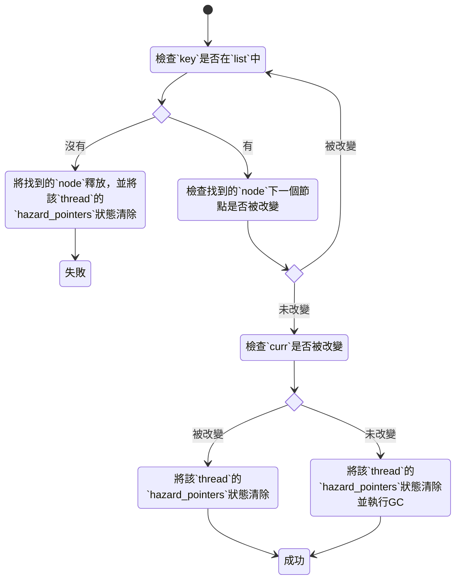

# 2021q3 Homework2 (hp)
contributed by < `GundamBox` >

###### tags: `linux2021`

## 開發環境

- CPU
    - Intel i3-4160 (2C4T)
- Distro
    - Ubuntu 20.04-LTS
- Kernel
    - 5.8.0-63-generic

## 開發之前

- [作業連結][linux2021-summer-homework2]

## 題目

### 1. 解釋上述程式碼運作原理

#### main

- `pthread_create` 建立 `thread` 並依照奇偶數分配動作 `list_insert` 與 `list_delete`

#### list_insert


#### list_delete



#### 細節

- 避免 `cacheline` 影響結果
    - `aligned_alloc`
    - `CLPAD`
    - `alignas(128)`
- `list_hp` 的 `hp`
    - 長度為 `HP_MAX_THREADS` 的指標陣列
        - 等於每個 `thread` 都
    - 在執行 `list_hp_new` 的時候，每個陣列元素都會分配到長度為 `CLPAD * 2` 個的空間
#### 執行結果解釋

```bash
$ gcc -Wall -o list list.c -lpthread -g -fsanitize=thread 
$ ./list 
inserts = 4098, deletes = 4098
```

- insert
    - `list_new` 的 `head` 跟 `tail` 會各做一次 insert
    - `N_THREADS` 有一半做 `insert_thread`，共 `N_ELEMENTS` * (`N_THREADS` / 2) 次的 insert
    - 加總起來為 2 + 128 * 32 = 2 + 4096 = 4098
- delete
    - `head` 跟 `tail` 會各做一次 delete
    - `N_THREADS` 有一半做 `delete_thread`，共 `N_ELEMENTS` * (`N_THREADS` / 2) 次的 delete
    - 加總起來為 2 + 128 * 32 = 2 + 4096 = 4098

### 2. 指出改進空間並著手實作

剛開始沒頭緒，參考同學`< R0inHizakura >`的[作業][RinHizakura_2021q3_homework2_hp]後找到靈感

1. 確認 `list` 的操作是對的
2. 確認 `hazard pointer` 的操作是對的

#### 改進過程

##### 驗證原本的程式碼在單一執行緒執行結果
- 先將 `N_ELEMENTS` 改為 5 觀察單一執行緒的結果
- 加入 `debug_list_print()`
    ```c
    void debug_list_print(list_t *list)
    {
        list_node_t *curr = NULL, *next = NULL;

        printf("debug info: ");
        curr = get_unmarked_node(list->head);
        for (; curr; curr = get_unmarked_node(curr->next)) {
    #if DEBUG_PRINT
            if (get_unmarked_node(curr->next)) {
                printf("0x%012lx -> ", curr->key);
            } else {
                printf("0x%012lx", curr->key);
            }
    #endif
            next = get_unmarked_node(curr->next);
            if (next) {
                assert(curr->key < next->key);
            }
        }
    #if DEBUG_PRINT
        printf("\n");
    #endif
    }
    ```
- 確認 linked list 的操作在單一執行緒的情況下是否正確
    ```c
    int main(void)
    {
        list_t *list = list_new();

        insert_thread(list);
        
        debug_list_print(list);
        
        list_destroy(list);
        
        fprintf(stderr, "inserts = %zu, deletes = %zu\n", atomic_load(&inserts),
            atomic_load(&deletes));
            
        return 0;
    }
    ```
- 執行結果
    ```bash
    list: list.c:389: main: Assertion `curr->key < next->key' failed.
    [1]    189660 abort (core dumped)  ./list
    ```
- 啟動 `DEBUG_PRINT`
    ```bash
    debug info: 0x564383ebf060 -> 0x564383ebf068 -> 0x564383ebf070 -> 
    .....
    0x564383ebf458 -> 0x000000000000 -> 0xffffffffffffffff
    ```
##### 改進 `list` 操作

根據 [A Pragmatic Implementation of Non-Blocking Linked Lists][A_Pragmatic_Implementation_of_Non-Blocking_Linked_Lists] 這篇論文改進 `list` 的操作

- insert
    1. find 0x02
    2. 進入 `while` 迴圈前
        ```graphviz
        digraph first_insert {
            node [shape = box]
            rankdir = LR
            head [label = "{head | 0x00 |<n> next}", shape = record];
            tail [label = "{tail | 0xff |<n> next}", shape = record];    
            prev [label = "prev", shape = plaintext]
            curr [label = "curr", shape = plaintext]
            next [label = "next", shape = plaintext]
            null [label = "NULL", shape = plaintext]
            head -> tail
            tail -> null
            prev -> head
            curr -> head
            next -> null
        }
        ```
    3. 進入 `while` 迴圈
        ```graphviz
        digraph first_insert {
            node [shape = box]
            rankdir = LR
            head [label = "{head | 0x00 |<n> next}", shape = record];
            tail [label = "{tail | 0xff |<n> next}", shape = record];    
            prev [label = "prev", shape = plaintext]
            curr [label = "curr", shape = plaintext]
            next [label = "next", shape = plaintext]
            null [label = "NULL", shape = plaintext]
            head -> tail
            tail -> null
            prev -> head
            curr -> head
            next -> tail
        }
        ```
    4. `next == tail` 成立
        ```graphviz
        digraph first_insert {
            node [shape = box]
            rankdir = LR
            head [label = "{head | 0x00 |<n> next}", shape = record];
            tail [label = "{tail | 0xff |<n> next}", shape = record];    
            prev [label = "prev", shape = plaintext]
            curr [label = "curr", shape = plaintext]
            next [label = "next", shape = plaintext]
            null [label = "NULL", shape = plaintext]
            head -> tail
            tail -> null
            prev -> head
            curr -> head
            next -> tail
        }
        ```
    5. insert-1
        - 原本的 `insert` 會讓 `node->next` 指向 `head`，造成前面錯誤的結果
            ```graphviz
            digraph first_insert {
                node [shape = box]
                rankdir = LR
                head [label = "{head | 0x00 |<n> next}", shape = record]
                tail [label = "{tail | 0xff |<n> next}", shape = record]
                new_node [label = "{node | 0x02 |<n> next}", shape = record]
                head -> tail
                new_node -> head
                tail -> null
                null [label = "NULL", shape = plaintext]
            }
            ```
        - 應該改為 `atomic_store_explicit(&node->next, (uintptr_t) next, memory_order_relaxed);`
            ```graphviz
            digraph first_insert {
                node [shape = box]
                rankdir = LR
                head [label = "{head | 0x00 |<n> next}", shape = record]
                tail [label = "{tail | 0xff |<n> next}", shape = record]
                new_node [label = "{node | 0x02 |<n> next}", shape = record]
                head -> tail
                new_node -> tail
                tail -> null
                prev -> head
                curr -> head
                next -> tail
                prev [label = "prev", shape = plaintext]
                curr [label = "curr", shape = plaintext]
                next [label = "next", shape = plaintext]
                null [label = "NULL", shape = plaintext]
            }
            ```
    6. insert-2
        - `atomic_compare_exchange_strong(prev, &tmp, (uintptr_t) node)` 會把 head 替換掉，應該讓 `prev->next` 或 `curr->next` 也就是 `head->next` 指向 `node`
            ```graphviz
            digraph first_insert {
                node [shape = box]
                rankdir = LR
                tail [label = "{tail | 0xff |<n> next}", shape = record]
                new_node [label = "{node | 0x02 |<n> next}", shape = record]
                new_node -> tail
                tail -> null
                null [label = "NULL", shape = plaintext]
            }
            ```
        - 改進為 
            ```c
            uintptr_t tmp = get_unmarked(curr->next);
            if (atomic_compare_exchange_strong(&curr->next, &tmp, (uintptr_t) node)) {
                ...                               
            }
            ```
            ```graphviz
            digraph first_insert {
                node [shape = box]
                rankdir = LR
                head [label = "{head | 0x00 |<n> next}", shape = record]
                tail [label = "{tail | 0xff |<n> next}", shape = record]
                new_node [label = "{node | 0x02 |<n> next}", shape = record]
                head -> new_node
                new_node -> tail
                tail -> null
                prev -> head
                curr -> head
                next -> tail
                prev [label = "prev", shape = plaintext]
                curr [label = "curr", shape = plaintext]
                next [label = "next", shape = plaintext]
                null [label = "NULL", shape = plaintext]
            }
            ```
    7. 結果
        ```bash
        debug info: 0x000000000000 -> 0x55b773f22060 -> 0x55b773f22068 -> 
        .....
        0x55b773f22080 -> 0xffffffffffffffff
        ```
- delete
    1. find 0x02
    2. 進入 `while` 迴圈前
        ```graphviz
        digraph first_insert {
            node [shape = box]
            rankdir = LR
            head [label = "{head | 0x00 |<n> next}", shape = record]
            n1 [label = "{n1 | 0x02 |<n> next}", shape = record]
            n2 [label = "{n2 | 0x04 |<n> next}", shape = record]
            n3 [label = "{n3 | 0x06 |<n> next}", shape = record]
            tail [label = "{tail | 0xff |<n> next}", shape = record]
            prev [label = "prev", shape = plaintext]
            curr [label = "curr", shape = plaintext]
            next [label = "next", shape = plaintext]
            null [label = "NULL", shape = plaintext]
            head -> n1
            n1 -> n2
            n2 -> n3
            n3 -> tail
            tail -> null
            prev -> head
            curr -> head
            next -> null    
        }
        ```
    3. 進入 `while` 迴圈
        ```graphviz
        digraph first_insert {
            node [shape = box]
            rankdir = LR
            head [label = "{head | 0x00 |<n> next}", shape = record]
            n1 [label = "{n1 | 0x02 |<n> next}", shape = record]
            n2 [label = "{n2 | 0x04 |<n> next}", shape = record]
            n3 [label = "{n3 | 0x06 |<n> next}", shape = record]
            tail [label = "{tail | 0xff |<n> next}", shape = record]
            prev [label = "prev", shape = plaintext]
            curr [label = "curr", shape = plaintext]
            next [label = "next", shape = plaintext]
            null [label = "NULL", shape = plaintext]
            head -> n1
            n1 -> n2
            n2 -> n3
            n3 -> tail
            tail -> null
            prev -> head
            curr -> head
            next -> n1 
        }
        ```
    4. `!(0x00 < 0x02)` 為 false
        ```graphviz
        digraph first_insert {
            node [shape = box]
            rankdir = LR
            head [label = "{head | 0x00 |<n> next}", shape = record]
            n1 [label = "{n1 | 0x02 |<n> next}", shape = record]
            n2 [label = "{n2 | 0x04 |<n> next}", shape = record]
            n3 [label = "{n3 | 0x06 |<n> next}", shape = record]
            tail [label = "{tail | 0xff |<n> next}", shape = record]
            prev [label = "prev", shape = plaintext]
            curr [label = "curr", shape = plaintext]
            next [label = "next", shape = plaintext]
            null [label = "NULL", shape = plaintext]
            head -> n1
            n1 -> n2
            n2 -> n3
            n3 -> tail
            tail -> null
            prev -> n1
            curr -> n1
            next -> n1 
        }
        ```
    5. 下一次迴圈
        ```graphviz
        digraph first_insert {
            node [shape = box]
            rankdir = LR
            head [label = "{head | 0x00 |<n> next}", shape = record]
            n1 [label = "{n1 | 0x02 |<n> next}", shape = record]
            n2 [label = "{n2 | 0x04 |<n> next}", shape = record]
            n3 [label = "{n3 | 0x06 |<n> next}", shape = record]
            tail [label = "{tail | 0xff |<n> next}", shape = record]
            prev [label = "prev", shape = plaintext]
            curr [label = "curr", shape = plaintext]
            next [label = "next", shape = plaintext]
            null [label = "NULL", shape = plaintext]
            head -> n1
            n1 -> n2
            n2 -> n3
            n3 -> tail
            tail -> null
            prev -> n1
            curr -> n1
            next -> n2 
        }
        ```
    6. `!(0x02 < 0x02)` 為 true
        ```graphviz
        digraph first_insert {
            node [shape = box]
            rankdir = LR
            head [label = "{head | 0x00 |<n> next}", shape = record]
            n1 [label = "{n1 | 0x02 |<n> next}", shape = record]
            n2 [label = "{n2 | 0x04 |<n> next}", shape = record]
            n3 [label = "{n3 | 0x06 |<n> next}", shape = record]
            tail [label = "{tail | 0xff |<n> next}", shape = record]
            prev [label = "prev", shape = plaintext]
            curr [label = "curr", shape = plaintext]
            next [label = "next", shape = plaintext]
            null [label = "NULL", shape = plaintext]
            head -> n1
            n1 -> n2
            n2 -> n3
            n3 -> tail
            tail -> null
            prev -> n1
            curr -> n1
            next -> n2 
        }
        ```
    7. delete-1
        - 要刪 `0x02` 卻 mark `0x04`，很奇怪
            ```graphviz
            digraph first_insert {
                node [shape = box]
                rankdir = LR
                head [label = "{head | 0x00 |<n> next}", shape = record]
                n1 [label = "{n1 | 0x02 |<n> next}", shape = record]
                n2 [label = "{n2(m) | 0x04 |<n> next}", shape = record]
                n3 [label = "{n3 | 0x06 |<n> next}", shape = record]
                tail [label = "{tail | 0xff |<n> next}", shape = record]
                prev [label = "prev", shape = plaintext]
                curr [label = "curr", shape = plaintext]
                next [label = "next", shape = plaintext]
                null [label = "NULL", shape = plaintext]
                head -> n1
                n1 -> n2
                n2 -> n3
                n3 -> tail
                tail -> null
                prev -> n1
                curr -> n1
                next -> n2 
            }
            ```
        - 改為
            ```c
            uintptr_t tmp = get_unmarked(curr);
            if (!atomic_compare_exchange_strong(&curr, &tmp, get_marked(curr)))
            ...
            ```
            ```graphviz
            digraph first_insert {
                node [shape = box]
                rankdir = LR
                head [label = "{head | 0x00 |<n> next}", shape = record]
                n1 [label = "{n1(m) | 0x02 |<n> next}", shape = record]
                n2 [label = "{n2 | 0x04 |<n> next}", shape = record]
                n3 [label = "{n3 | 0x06 |<n> next}", shape = record]
                tail [label = "{tail | 0xff |<n> next}", shape = record]
                prev [label = "prev", shape = plaintext]
                curr [label = "curr", shape = plaintext]
                next [label = "next", shape = plaintext]
                null [label = "NULL", shape = plaintext]
                head -> n1
                n1 -> n2
                n2 -> n3
                n3 -> tail
                tail -> null
                prev -> n1
                curr -> n1
                next -> n2 
            }
            ```
    8. delete-2
        - `prev` 跟 `curr` 在 `__list_find` 一直指向同一個地方，這邊沒辦法做 `delete`
        - `prev`、`curr`、`next` 命名語意會讓人覺得是三個連續的 `node`，這邊有兩個方案
            1. 修改 `__list_find` 演算法，符合命名語意
            2. 改用[論文][A_Pragmatic_Implementation_of_Non-Blocking_Linked_Lists]的作法
- 修改 `__list_find` 演算法
    - 修改前
        ```c
        static bool __list_find(list_t *list,
                                list_key_t *key,
                                atomic_uintptr_t **par_prev,
                                list_node_t **par_curr,
                                list_node_t **par_next)
        {
            atomic_uintptr_t *prev = NULL;
            list_node_t *curr = NULL, *next = NULL;

        try_again:
            prev = &list->head;
            // curr 應該改成 prev->next 才比較符合命名語意
            curr = (list_node_t *) atomic_load(prev);
            (void) list_hp_protect_ptr(list->hp, HP_CURR, (uintptr_t) curr);
            if (atomic_load(prev) != get_unmarked(curr))
                goto try_again;
            while (true) {
                // 功能跟檢查 next == list->tail 重複，這段要拿掉
                if (!get_unmarked_node(curr))
                    return false;
                next = (list_node_t *) atomic_load(&get_unmarked_node(curr)->next);
                (void) list_hp_protect_ptr(list->hp, HP_NEXT, get_unmarked(next));
                // curr 到 next 中間被插隊應該重試比較合理
                if (atomic_load(&get_unmarked_node(curr)->next) != (uintptr_t) next)
                    break;
                if (get_unmarked(next) == atomic_load((atomic_uintptr_t *) &list->tail))
                    break;
                // 應該改成檢查 prev 跟 curr 中間有沒有被插隊
                if (atomic_load(prev) != get_unmarked(curr))
                    goto try_again;
                // 覺得改成檢查 curr 比較合理
                if (get_unmarked_node(next) == next) {
                    if (!(get_unmarked_node(curr)->key < *key)) {
                        *par_curr = curr;
                        *par_prev = prev;
                        *par_next = next;
                        return get_unmarked_node(curr)->key == *key;
                    }
                    prev = &get_unmarked_node(curr)->next;
                    (void) list_hp_protect_release(list->hp, HP_PREV,
                                                   get_unmarked(curr));
                } else {
                    uintptr_t tmp = get_unmarked(curr);
                    if (!atomic_compare_exchange_strong(prev, &tmp, get_unmarked(next)))
                        goto try_again;
                    list_hp_retire(list->hp, get_unmarked(curr));
                }
                curr = next;
                (void) list_hp_protect_release(list->hp, HP_CURR, get_unmarked(next));
            }
            *par_curr = curr;
            *par_prev = prev;
            *par_next = next;

            return false;
        }
        ```
    - 修改後
        ```c
        static bool __list_find(list_t *list,
                                list_key_t *key,
                                list_node_t **par_prev,
                                list_node_t **par_curr,
                                list_node_t **par_next)
        {
            list_node_t *prev = NULL, *curr = NULL, *next = NULL;

        try_again:
            prev = list->head;
            curr = (list_node_t *) atomic_load(&(prev->next));
            (void) list_hp_protect_ptr(list->hp, HP_CURR, (uintptr_t) curr);
            if (atomic_load(&(prev->next)) != get_unmarked(curr))
                goto try_again;
            while (true) {
                next = (list_node_t *) atomic_load(&get_unmarked_node(curr)->next);
                (void) list_hp_protect_ptr(list->hp, HP_NEXT, get_unmarked(next));
                // curr 到 next 中間被插隊，重試
                if (atomic_load(&get_unmarked_node(curr)->next) != (uintptr_t) next)
                    goto try_again;
                // prev 到 curr 中間被插隊，重試
                if (atomic_load(&get_unmarked_node(prev)->next) != get_unmarked(curr))
                    goto try_again;
                // 到 tail 還找不到
                if (get_unmarked(curr) == atomic_load((atomic_uintptr_t *) &list->tail))
                    break;
                if (get_unmarked_node(curr) == curr) {
                    if (!(get_unmarked_node(curr)->key < *key)) {
                        // curr 沒被 mark 且 curr->key >= key
                        *par_prev = prev;
                        *par_curr = curr;
                        *par_next = next;
                        return get_unmarked_node(curr)->key == *key;
                    }
                    prev = get_unmarked_node(curr);
                    (void) list_hp_protect_release(list->hp, HP_PREV,
                                                   get_unmarked(curr));
                } else {
                    // curr 被 mark，嘗試將 prev->next，指向 next
                    // 若失敗表示 prev 有修改，重試
                    uintptr_t tmp = get_unmarked(curr);
                    if (!atomic_compare_exchange_strong(&(prev->next), &tmp,
                                                        get_unmarked(next)))
                        goto try_again;
                    list_hp_retire(list->hp, get_unmarked(curr));
                }
                curr = next;
                (void) list_hp_protect_release(list->hp, HP_CURR, get_unmarked(next));
            }
            *par_prev = prev;
            *par_curr = curr;
            *par_next = next;

            return false;
        }
        
        bool list_insert(list_t *list, list_key_t key)
        {
            list_node_t *prev = NULL, *curr = NULL, *next = NULL;

            list_node_t *node = list_node_new(key);

            while (true) {
                if (__list_find(list, &key, &prev, &curr, &next)) {
                    list_node_destroy(node);
                    list_hp_clear(list->hp);
                    return false;
                }
                atomic_store_explicit(&node->next, (uintptr_t) curr,
                                      memory_order_relaxed);
                uintptr_t tmp = get_unmarked(prev->next);
                if (atomic_compare_exchange_strong(&(prev->next), &tmp,
                                                   (uintptr_t) node)) {
                    list_hp_clear(list->hp);
                    return true;
                }
            }
        }

        bool list_delete(list_t *list, list_key_t key)
        {
            list_node_t *prev, *curr, *next;

            while (true) {
                if (!__list_find(list, &key, &prev, &curr, &next)) {
                    list_hp_clear(list->hp);
                    return false;
                }

                uintptr_t tmp = get_unmarked(curr);

                if (!atomic_compare_exchange_strong(&curr, &tmp, get_marked(curr))) {
                    continue;
                }

                tmp = get_unmarked(curr);
                if (atomic_compare_exchange_strong(&(prev->next), &tmp,
                                                   get_unmarked(next))) {
                    list_hp_clear(list->hp);
                    list_hp_retire(list->hp, get_unmarked(curr));
                } else {
                    list_hp_clear(list->hp);
                }
                return true;
            }
        }
        ```
    - 結果
        ```bash
        debug info: 0x000000000000 -> 0x55ebf3629060 -> 0xffffffffffffffff
        debug info: 0x000000000000 -> 0x55ebf3629060 -> 0x55ebf3629068 -> 0xffffffffffffffff
        debug info: 0x000000000000 -> 0x55ebf3629060 -> 0x55ebf3629068 -> 0x55ebf3629070 -> 0xffffffffffffffff
        debug info: 0x000000000000 -> 0x55ebf3629060 -> 0x55ebf3629068 -> 0x55ebf3629070 -> 0x55ebf3629078 -> 0xffffffffffffffff
        debug info: 0x000000000000 -> 0x55ebf3629060 -> 0x55ebf3629068 -> 0x55ebf3629070 -> 0x55ebf3629078 -> 0x55ebf3629080 -> 0xffffffffffffffff

        debug info: 0x000000000000 -> 0x55ebf3629068 -> 0x55ebf3629070 -> 0x55ebf3629078 -> 0x55ebf3629080 -> 0xffffffffffffffff
        debug info: 0x000000000000 -> 0x55ebf3629070 -> 0x55ebf3629078 -> 0x55ebf3629080 -> 0xffffffffffffffff
        debug info: 0x000000000000 -> 0x55ebf3629078 -> 0x55ebf3629080 -> 0xffffffffffffffff
        debug info: 0x000000000000 -> 0x55ebf3629080 -> 0xffffffffffffffff
        debug info: 0x000000000000 -> 0xffffffffffffffff
        inserts = 7, deletes = 7
        ```
- 用[論文][A_Pragmatic_Implementation_of_Non-Blocking_Linked_Lists]的作法
    list 操作在單一執行緒的執行結果也是對的
    ```c
    static list_node_t *__list_find(list_t *list,
                                    list_key_t key,
                                    list_node_t **left_node)
    {
        list_node_t *left_node_next, *right_node;
        list_node_t *curr, *curr_next;
    try_again:
        do {
            curr = (list_node_t *) list->head;
            curr_next = (list_node_t *) ((list_node_t *) list->head)->next;
            do {
                if (!is_marked(curr_next)) {
                    *left_node = curr;
                    (void) list_hp_protect_ptr(list->hp, HP_PREV,
                                               get_unmarked(curr));
                    left_node_next = curr_next;
                    (void) list_hp_protect_ptr(list->hp, HP_CURR,
                                               get_unmarked(curr_next));
                }
                curr = get_unmarked_node(curr_next);
                if (curr == (list_node_t *) list->tail) {
                    break;
                }
                curr_next = (list_node_t *) curr->next;
            } while (is_marked(curr_next) || curr->key < key);
            right_node = curr;
            (void) list_hp_protect_ptr(list->hp, HP_NEXT, get_unmarked(curr));

            /* 2: Check nodes are adjacent */
            if (left_node_next == right_node) {
                if ((right_node != (list_node_t *) list->tail) &&
                    is_marked((right_node)->next)) {
                    goto try_again; /*G1*/
                } else {
                    return right_node; /*R1*/
                }
            }

            /* 3: Remove one or more marked nodes */
            if (atomic_compare_exchange_strong(&(*left_node)->next, &left_node_next,
                                               right_node)) { /*C1*/
                list_hp_retire(list->hp, get_unmarked(left_node_next));
                if (right_node != (list_node_t *) list->tail &&
                    is_marked(right_node->next)) {
                    goto try_again; /*G2*/
                } else {
                    return right_node; /*R2*/
                }
            }
        } while (true); /*B2*/
    }

    bool list_insert(list_t *list, list_key_t key)
    {
        list_node_t *new_node = list_node_new(key);
        list_node_t *next, *prev;

        do {
            next = __list_find(list, key, &prev);
            if (next != (list_node_t *) list->tail && next->key == key) { /*T1*/
                list_node_destroy(new_node);
                list_hp_clear(list->hp);
                return false;
            }
            new_node->next = (uintptr_t) next;
            if (atomic_compare_exchange_strong(&prev->next, &next,
                                               new_node)) { /*C2*/
                list_hp_clear(list->hp);
                return true;
            }
        } while (true); /*B3*/
    }

    bool list_delete(list_t *list, list_key_t key)
    {
        list_node_t *curr = NULL, *next = NULL, *prev = NULL;
        do {
            curr = __list_find(list, key, &prev);
            if (curr == (list_node_t *) list->tail || curr->key != key) { /*T1*/
                list_hp_clear(list->hp);
                return false;
            }
            next = (list_node_t *) curr->next;
            if (!is_marked(next)) {
                if (atomic_compare_exchange_strong((list_node_t **) &(curr->next),
                                                   &next,
                                                   get_marked(next))) { /*C3*/
                    break;
                }
            }
        } while (true); /*B4*/

        if (atomic_compare_exchange_strong((list_node_t **) &(prev->next), &curr,
                                           next)) { /*C4*/
            // curr = __list_find(list, curr->key, &prev);
            list_hp_clear(list->hp);
            list_hp_retire(list->hp, get_unmarked(curr));
        } else {
            list_hp_clear(list->hp);
        }

        return true;
    }
    ```
- 改回多執行緒環境測試
    - 執行結果
        ```bash
        inserts = 4098, deletes = 4098
        ```
    - 一些想法
        1. 不確定自己改的 `__list_find` 是否正確，還是只是數字剛好？
        2. benchmark
            - Harris 版本
                
            - 自己的版本
##### TODO
- [ ] 改進 hazard pointer 操作 
    讀[論文][Lock-Free_Data_Structures_with_Hazard_Pointers]看看 `hazard pointer` 哪邊可以改進
- [ ] 測試對齊寬度的影響
    - 同學 [9m77fans][9m77fans_2021q3_homework2_hp] 的有提到
        > 一般我們解決false sharing都是將資料對齊一個cache line就夠了,這邊卻是對齊兩個,目前我是只有看到folly這套facebook的函式庫有這樣做,它註解中寫到這是他們實驗的結果,兩個cache line對齊再跟atomic變數操作時效能比較好

### 3. 對比 rcu_list，解釋同為 lock-free 演算法，跟上述 Hazard pointer 手法有何異同？能否指出 rcu_list 實作缺陷並改進？

:::info
施工中
:::

## 參考資料

1. [A Pragmatic Implementation of Non-Blocking Linked Lists][A_Pragmatic_Implementation_of_Non-Blocking_Linked_Lists]
2. [Lock-Free Data Structures with Hazard Pointers][Lock-Free_Data_Structures_with_Hazard_Pointers]

[linux2021-summer-homework2]: https://hackmd.io/@sysprog/linux2021-summer-homework2
[RinHizakura_2021q3_homework2_hp]: https://hackmd.io/@RinHizakura/S1WCkafJY#%E9%8C%AF%E8%AA%A4%E4%BF%AE%E6%AD%A3%E8%88%87%E7%A8%8B%E5%BC%8F%E6%94%B9%E9%80%B2
[9m77fans_2021q3_homework2_hp]: https://hackmd.io/@9m77fans/sysprog2021q3-hw2#link-list-API
[A_Pragmatic_Implementation_of_Non-Blocking_Linked_Lists]: https://www.cl.cam.ac.uk/research/srg/netos/papers/2001-caslists.pdf
[Lock-Free_Data_Structures_with_Hazard_Pointers]: https://erdani.org/publications/cuj-2004-12.pdf
