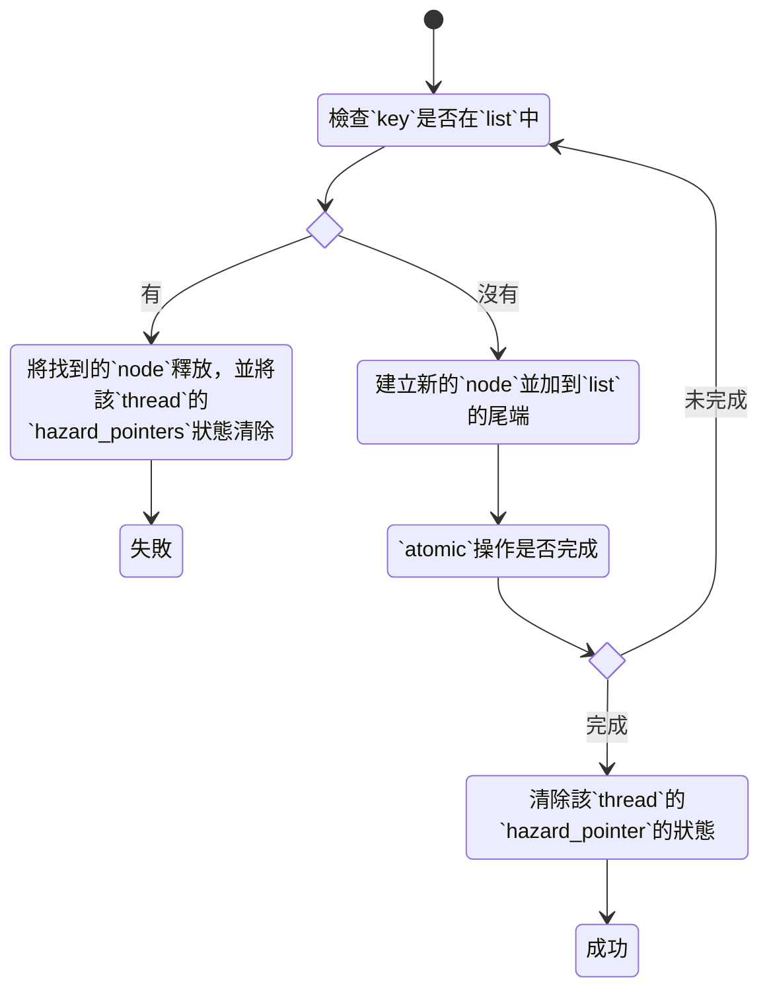
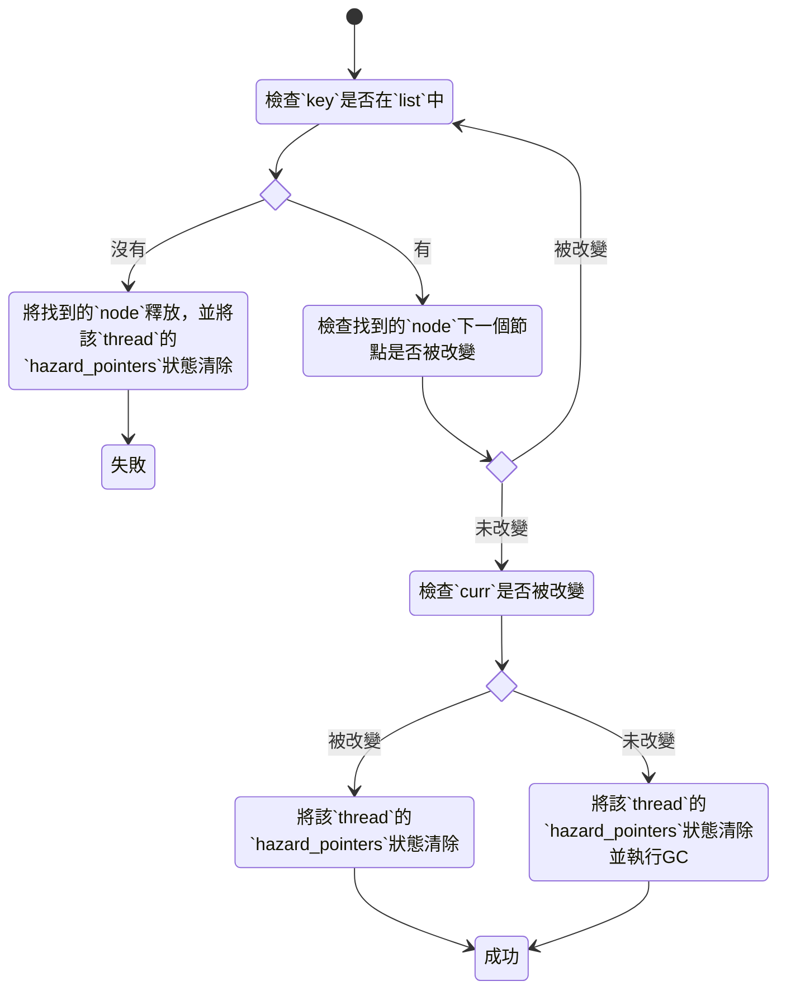

# 2021q3 Homework2 (hp)
contributed by < `GundamBox` >

###### tags: `linux2021`

## 開發之前

- [作業連結][linux2021-summer-homework2]

## 題目

### 1. 解釋上述程式碼運作原理

#### main

- `pthread_create` 建立 `thread` 並依照奇偶數分配動作 `list_insert` 與 `list_delete`

#### list_insert



#### list_delete



#### 細節

- 避免 `cacheline` 影響結果
    - `aligned_alloc`
    - `CLPAD`
    - `alignas(128)`
    
#### 執行結果解釋

```bash
$ gcc -Wall -o list list.c -lpthread -g -fsanitize=thread 
$ ./list 
inserts = 4098, deletes = 4098
```

- insert
    - `list_new` 的 `head` 跟 `tail` 會各做一次 insert
    - `N_THREADS` 有一半做 `insert_thread`，共 `N_ELEMENTS` * (`N_THREADS` / 2) 次的 insert
    - 加總起來為 2 + 128 * 32 = 2 + 4096 = 4098
- delete
    - `head` 跟 `tail` 會各做一次 delete
    - `N_THREADS` 有一半做 `delete_thread`，共 `N_ELEMENTS` * (`N_THREADS` / 2) 次的 delete
    - 加總起來為 2 + 128 * 32 = 2 + 4096 = 4098

### 2. 指出改進空間並著手實作

### 3. 對比 rcu_list，解釋同為 lock-free 演算法，跟上述 Hazard pointer 手法有何異同？能否指出 rcu_list 實作缺陷並改進？

## 參考資料

[linux2021-summer-homework2]: https://hackmd.io/@sysprog/linux2021-summer-homework2